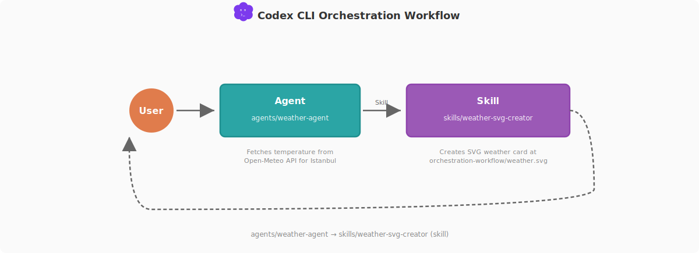

# Orchestration Workflow

This workflow demonstrates the smallest useful Codex pattern in this repository:

```text
User prompt -> weather-agent -> weather-svg-creator skill -> SVG + markdown output
```

The example is intentionally simple so maintainers can inspect every moving part.

| Component | Path | Role |
|---|---|---|
| Agent | `.codex/agents/weather-agent.toml` | Fetches Istanbul weather from Open-Meteo |
| Skill | `.agents/skills/weather-svg-creator/SKILL.md` | Renders the SVG card and markdown report |
| SVG output | `orchestration-workflow/weather.svg` | Visual weather card |
| Markdown output | `orchestration-workflow/output.md` | Human-readable report |

## How To Run

Start Codex from the repository root:

```bash
codex --profile development
```

Prompt:

```text
Fetch the current weather for Istanbul in Celsius and create the SVG weather card output using the repo.
```

For Fahrenheit, replace `Celsius` with `Fahrenheit`.

## Flow Diagram

<p align="center">
  
</p>

## Execution Contract

1. The user specifies unit preference in the prompt.
2. `weather-agent` fetches the current temperature for Istanbul.
3. The agent invokes `/weather-svg-creator`.
4. The skill writes `weather.svg` and `output.md`.
5. Codex returns the temperature, unit, and both output paths.

## Why The Split Matters

- The agent owns live data fetching.
- The skill owns deterministic rendering.
- The output files are overwritten cleanly on each run.
- The pattern is easy to adapt for dashboards, reports, and status cards.

## Design Notes

- The skill must not refetch weather data.
- The agent must not write the SVG directly.
- The workflow defaults to Celsius when no unit is provided.
- Open-Meteo is used because the demo does not need API keys.

Back to [README](../README.md).
